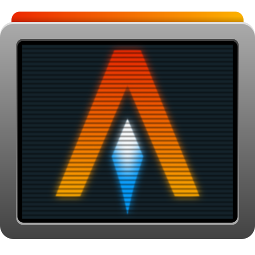
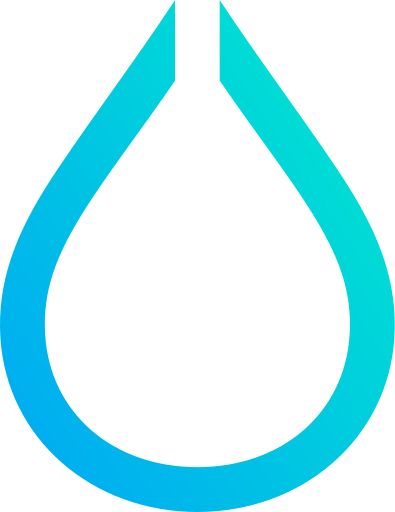

# NixOS Packages - Software

<h2>Desktop_app</h2>

<table>
<tr>
    <td>Type</td>
    <td>Icon</td>
    <td>NixOS-Configuration Name</td>
    <td>Info</td>
</tr>
<tr>
    <td rowspan=3>Browser</td>
    <a href="https://www.firefox.com/en-US/">
        <td></td>
        <td>firefox</td>
        <td>Веб-браузер, построенный из дерева источников Firefox</td>
    </a>
</tr>
<tr>
    <a href="https://librewolf.net/">
        <td></td>
        <td>librewolf</td>
        <td>Форк Firefox, ориентированный на неприкосновенность частной жизни, безопасность и свободу</td>
    </a>
</tr>
<tr>
    <td></td>
    <td>chromium</td>
    <td></td>
</tr>
<tr>
    <td rowspan=4>Editors</td>
    <td></td>
    <td>vscodium</td>
    <td></td>
</tr>
<tr>
    <td></td>
    <td>code-cursor</td>
    <td></td>
</tr>
<tr>
    <td></td>
    <td>zed-editor</td>
    <td></td>
</tr>
<tr>
    <td></td>
    <td><del>android-studio</td>
    <td></td>
</tr>
<tr>
    <td rowspan=2>Tools</td>
    <td></td>
    <td>obsidian</td>
    <td></td>
</tr>
<tr>
    <td></td>
    <td>github-desktop</td>
    <td></td>
</tr>
<tr>
    <td rowspan=4>Chat</td>
    <td></td>
    <td>diskord</td>
    <td></td>
</tr>
<tr>
    <td></td>
    <td>telegram-desktop</td>
    <td></td>
</tr>
<tr>
    <td></td>
    <td>simplex-chat-desktop</td>
    <td></td>
</tr>
<tr>
    <td></td>
    <td>thunderbird</td>
    <td></td>
</tr>
<tr>
    <td rowspan=8>Media</td>
    <td></td>
    <td><del>spotify</td>
    <td></td>
</tr>
<tr>
    <td></td>
    <td>vlc</td>
    <td></td>
</tr>
<tr>
    <td></td>
    <td>obs-studio</td>
    <td></td>
</tr>
<tr>
    <td></td>
    <td>easyeffects</td>
    <td></td>
</tr>
<tr>
    <td></td>
    <td>youtube-music</td>
    <td></td>
</tr>
<tr>
    <td></td>
    <td>davinci-resolve</td>
    <td></td>
</tr>
<tr>
    <td></td>
    <td><del>shotcut</td>
    <td></td>
</tr>
<tr>
    <td></td>
    <td><del>olive-editor</td>
    <td></td>
</tr>
<tr>
    <td rowspan=1>AI</td>
    <td></td>
    <td>lmstudio</td>
    <td></td>
</tr>
<tr>
    <td rowspan=1>WinApps</td>
    <td></td>
    <td>freerdp</td>
    <td></td>
</tr>
<tr>
    <td rowspan=1>Training_programs</td>
    <td></td>
    <td>logisim</td>
    <td></td>
</tr>
<tr>
    <td rowspan=8>All</td>
    <td></td>
    <td>authenticator</td>
    <td></td>
</tr>
</table>

<h2>CLI</h2>

<table>
<tr>
    <td>Type</td>
    <td>Icon</td>
    <td>NixOS-Configuration Name</td>
    <td>Info</td>
</tr>
<tr>
    <td rowspan=1>Bash</td>
    <td></td>
    <td>fish</td>
    <td></td>
</tr>
<tr>
    <td rowspan=2>Editors</td>
    <td></td>
    <td>vim</td>
    <td></td>
</tr>
<tr>
    <td></td>
    <td>neovim</td>
    <td></td>
</tr>
<tr>
    <td rowspan=4>Lazy</td>
    <td></td>
    <td>lazycli</td>
    <td></td>
</tr>
<tr>
    <td></td>
    <td>lazygit</td>
    <td></td>
</tr>
<tr>
    <td></td>
    <td>lazydocker</td>
    <td></td>
</tr>
<tr>
    <td></td>
    <td>lazyssh</td>
    <td></td>
</tr>
<tr>
    <td rowspan=4>Fetch</td>
    <td></td>
    <td>neofetch</td>
    <td></td>
</tr>
<tr>
    <td></td>
    <td>fastfetch</td>
    <td></td>
</tr>
<tr>
    <td></td>
    <td>cpufetch</td>
    <td></td>
</tr>
<tr>
    <td></td>
    <td>nerdfetch</td>
    <td></td>
</tr>
<tr>
    <td rowspan=5>Top</td>
    <td></td>
    <td>htop</td>
    <td></td>
</tr>
<tr>
    <td></td>
    <td>btop</td>
    <td></td>
</tr>
<tr>
    <td></td>
    <td>neohtop</td>
    <td></td>
</tr>
<tr>
    <td></td>
    <td>nvtopPackages.full</td>
    <td></td>
</tr>
<tr>
    <td></td>
    <td>duf</td>
    <td></td>
</tr>
<tr>
    <td rowspan=2>Terminal</td>
    <td></td>
    <td>alacritty</td>
    <td></td>
</tr>
<tr>
    <td></td>
    <td>yazi</td>
    <td></td>
</tr>
<tr>
    <td rowspan=7>All</td>
    <td></td>
    <td>jq</td>
    <td></td>
</tr>
<tr>
    <td></td>
    <td>fd</td>
    <td></td>
</tr>
<tr>
    <td></td>
    <td>lsd</td>
    <td></td>
</tr>
<tr>
    <td></td>
    <td>bat</td>
    <td></td>
</tr>
<tr>
    <td></td>
    <td>wget</td>
    <td></td>
</tr>
<tr>
    <td></td>
    <td>cava</td>
    <td></td>
</tr>
<tr>
    <td></td>
    <td>git</td>
    <td></td>
</tr>
</table>

<h2>Code</h2>

<table>
<tr>
    <td>Type</td>
    <td>Icon</td>
    <td>NixOS-Configuration Name</td>
    <td>Info</td>
</tr>
<tr>
    <td rowspan=2>Python</td>
    <td></td>
    <td>python3</td>
    <td></td>
</tr>
<tr>
    <td></td>
    <td>uv</td>
    <td></td>
</tr>
<tr>
    <td rowspan=1>JS</td>
    <td></td>
    <td>nodejs_22</td>
    <td></td>
</tr>
<tr>
    <td rowspan=1>DevOps</td>
    <td></td>
    <td>docker</td>
    <td></td>
</tr>
</table>

<h2>Drivers</h2>

<table>
<tr>
    <td>Type</td>
    <td>Icon</td>
    <td>NixOS-Configuration Name</td>
    <td>Info</td>
</tr>
<tr>
    <td rowspan=3>FFmpeg</td>
    <td></td>
    <td>jellyfin-ffmpeg</td>
    <td></td>
</tr>
<tr>
    <td></td>
    <td>ffmpeg_6-full</td>
    <td></td>
</tr>
<tr>
    <td></td>
    <td>ffmpeg_6</td>
    <td></td>
</tr>
<tr>
    <td rowspan=2>All</td>
    <td></td>
    <td>intel-ocl</td>
    <td></td>
</tr>
<tr>
    <td></td>
    <td>cudatext</td>
    <td></td>
</tr>
</table>

<h2>Style</h2>

<table>
<tr>
    <td>Type</td>
    <td>Icon</td>
    <td>NixOS-Configuration Name</td>
    <td>Info</td>
</tr>
<tr>
    <td rowspan=4>Editors</td>
    <td></td>
    <td></td>
    <td></td>
</tr>
</table>

<h2>Games</h2>

<table>
<tr>
    <td>Type</td>
    <td>Icon</td>
    <td>NixOS-Configuration Name</td>
    <td>Info</td>
</tr>
<tr>
    <td rowspan=1>Engine</td>
    <td></td>
    <td>godot</td>
    <td></td>
</tr>
<tr>
    <td rowspan=2>Minecraft</td>
    <td></td>
    <td><del>unar-client</td>
    <td></td>
</tr>
<tr>
    <td></td>
    <td><del>prismlauncher</td>
    <td></td>
</tr>
<tr>
    <td rowspan=3>Steam</td>
    <td></td>
    <td>steam</td>
    <td></td>
</tr>
<tr>
    <td></td>
    <td>adwsteamgtk</td>
    <td></td>
</tr>
<tr>
    <td></td>
    <td><del>lutris</td>
    <td></td>
</tr>
</table>

<h2>WMS</h2>

<table>
<tr>
    <td>Type</td>
    <td>Icon</td>
    <td>NixOS-Configuration Name</td>
    <td>Info</td>
</tr>
<tr>
    <td rowspan=2>Bar</td>
    <td></td>
    <td>waybar</td>
    <td></td>
</tr>
<tr>
    <td></td>
    <td>eww</td>
    <td></td>
</tr>
<tr>
    <td rowspan=1>Launcher</td>
    <td></td>
    <td>rofi</td>
    <td></td>
</tr>
<tr>
    <td rowspan=3>Hypr</td>
    <td></td>
    <td>hyprland</td>
    <td></td>
</tr>
<tr>
    <td></td>
    <td>hyprlock</td>
    <td></td>
</tr>
<tr>
    <td></td>
    <td>hypridle</td>
    <td></td>
</tr>
</table>

